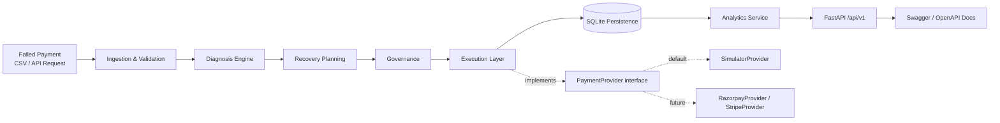

# Recur — AI Revenue Recovery System

**An end-to-end AI-driven pipeline that diagnoses failed recurring payments, plans a recovery action, governs it against business rules, executes it, and persists a full auditable trail — exposed as a versioned, production-structured REST API.**

[](https://github.com/Anushka-kumari22/recur-ai-revenue-recovery/actions)
[](https://www.python.org/)
[](https://fastapi.tiangolo.com/)
[](#testing)
[](#license)

🔗 **Live API**: [https://revenuepulse-app.onrender.com](https://revenuepulse-app.onrender.com)
📘 **Interactive docs**: [https://revenuepulse-app.onrender.com/docs](https://revenuepulse-app.onrender.com/docs)
❤️ **Health check**: [https://revenuepulse-app.onrender.com/api/v1/health](https://revenuepulse-app.onrender.com/api/v1/health)

---

## Why this project exists

Every subscription business loses revenue to failed recurring payments — a card expires, a bank declines a charge, a mandate lapses, a network call times out. Most systems log the failure and stop there. **Recur automates the decision that comes next**: what actually caused this failure, what's the right way to recover it, is that action safe and compliant to take automatically, and what happened when it ran — with every step of that reasoning captured in an audit trail.

This isn't a toy CRUD app. It's a layered decision-making pipeline, built the way I'd want a production financial system built: each concern isolated, each risky boundary behind an interface, everything tested, everything traceable.

---

## Live, verified results

This isn't a claim — it's a real request run against the live deployment:

```json
POST /api/v1/pipeline/process
{
  "record_id": "deploy_verify_001",
  "failure_type": "network_timeout",
  "amount": "1500.00",
  ...
}
```

**Response** (abbreviated):
```json
{
  "pipeline_status": "completed",
  "diagnosis": { "root_cause": "temporary_technical_issue", "confidence": 0.95 },
  "recovery_plan": { "action": "retry_payment", "expected_recovery_value": "1200.00" },
  "governance": { "decision": "approved", "reason": "action_approved" },
  "execution": { "status": "successful", "recovered_amount": "1500.00" }
}
```

Immediately after, the analytics endpoint correctly reflected it:
```json
{
  "total_records": 1,
  "total_amount_at_risk": "1500.00",
  "total_recovered_amount": "1500.00",
  "recovery_rate_pct": 100.0
}
```

Diagnosis → planning → governance → execution → persistence → analytics, verified end to end on the actual deployed service, not just locally.

---

## Architecture



| Stage | Responsibility |
|---|---|
| **Ingestion** | Validates raw payment failure data into a typed `FailureRecord` (positive amounts, non-negative attempt counts, normalized currency, non-empty identifiers) |
| **Diagnosis** | Maps a failure type to a root cause with a confidence score and reasoning (`network_timeout` → `temporary_technical_issue`, `card_expired` → `payment_instrument_expired`, etc.) |
| **Recovery Planning** | Selects a recovery action per root cause and computes expected recovery probability and value |
| **Governance** | Approves, blocks, or escalates the plan — enforces retry limits, customer-contact limits, and mandatory human review for risk-flagged cases |
| **Execution** | Runs the approved action through a `PaymentProvider` interface, with deterministic idempotency keys preventing duplicate execution |
| **Persistence** | Saves the complete lifecycle of every record — failure, diagnosis, plan, governance decision, execution result — to a single auditable table |
| **Analytics** | Aggregates persisted records into financial and governance metrics, computed live from the database, never from synthetic display data |
| **API** | Versioned (`/api/v1`), typed request/response schemas, dependency injection, a thin router layer over a testable service layer |

### Design decisions worth asking me about

- **`PaymentProvider` interface, not a direct Razorpay/Stripe integration.** Execution runs entirely against a deterministic `SimulatorProvider` today. A real gateway adapter implements the exact same two-method interface (`create_retry`, `send_notification`) and swaps in with zero changes to governance, persistence, or any business logic. This was a deliberate choice to keep the demo reliable and the architecture honest about what's simulated versus real.
- **Recommendation and authorization are separate layers.** Recovery Planning *recommends* an action; Governance *decides* whether it's actually allowed to run. A recovery plan can be sound and still get blocked — that separation is what makes the system auditable rather than just automated.
- **The API never returns internal domain objects directly.** Every endpoint maps onto an explicit response schema, so internal refactors can't silently break API consumers.

---

## Technology Stack

| Layer | Technology |
|---|---|
| Language | Python 3.12 |
| API Framework | FastAPI, Uvicorn |
| Validation | Pydantic v2, pydantic-settings |
| Persistence | SQLAlchemy ORM, SQLite |
| Testing | pytest, FastAPI `TestClient` |
| CI/CD | GitHub Actions |
| Containerization | Docker |
| Deployment | Render |

---

## Project Structure

```
recur-ai-revenue-recovery/
├── src/recur/
│   ├── models/            # Core domain models (FailureRecord, enums)
│   ├── ingestion/          # CSV loading & validation
│   ├── diagnosis/            # Root-cause diagnosis engine
│   ├── recovery/                # Recovery action planning
│   ├── governance/                 # Approval / blocking / review rules
│   ├── execution/                     # PaymentProvider interface + SimulatorProvider
│   ├── orchestration/                    # Pipeline wiring (process_failure)
│   ├── persistence/                         # SQLAlchemy models, repository, database setup
│   ├── analytics/                              # Dashboard metrics service
│   ├── services/                                  # Application service layer
│   ├── config/                                       # Centralized pydantic-settings config
│   ├── exceptions/                                      # Custom exception hierarchy
│   └── api/                                                 # FastAPI app, routers, schemas
│       ├── main.py
│       ├── schemas.py
│       └── routers/
│           ├── health.py
│           ├── pipeline.py
│           └── analytics.py
├── scripts/
│   └── process_batch.py     # CSV batch processing entrypoint
├── tests/
│   ├── api/                    # API endpoint tests
│   └── unit/                      # Per-layer unit tests
├── data/
│   ├── raw/                          # Input CSV datasets
│   └── database/                        # SQLite database (gitignored)
├── Dockerfile
├── docker-compose.yml
├── requirements.txt
└── .github/workflows/ci.yml
```

---

## Getting Started

### Prerequisites
- Python 3.12+
- pip

### Local setup

```bash
git clone https://github.com/Anushka-kumari22/recur-ai-revenue-recovery.git
cd recur-ai-revenue-recovery

python -m venv .venv
source .venv/bin/activate      # Windows: .venv\Scripts\activate

pip install -r requirements.txt
```

### Run the test suite

```bash
PYTHONPATH=src python -m pytest -v
```

### Run the batch pipeline against the sample dataset

```bash
PYTHONPATH=src python scripts/process_batch.py
```

### Run the API locally

```bash
PYTHONPATH=src uvicorn recur.api.main:app --reload
```
Then visit `http://localhost:8000/docs` for interactive Swagger documentation.

### Run with Docker

```bash
docker build -t recur-api .
docker run -p 8000:8000 recur-api
```
or
```bash
docker-compose up
```

---

## API Reference

| Method | Endpoint | Description |
|---|---|---|
| `GET` | `/` | API root — service status and quick links |
| `GET` | `/api/v1/health` | Health check |
| `POST` | `/api/v1/pipeline/process` | Run a failed payment through the full recovery pipeline |
| `GET` | `/api/v1/analytics/dashboard` | Aggregated financial and governance metrics |
| `GET` | `/recoveries` | Paginated recovery history, filterable by customer/status |
| `GET` | `/recoveries/{record_id}` | Full recovery detail for a single record |
| `GET` | `/docs` | Interactive OpenAPI/Swagger documentation |

Full request/response schemas are documented interactively at [`/docs`](https://revenuepulse-app.onrender.com/docs) — every field is typed and validated via Pydantic, and every error response follows a single consistent `ErrorResponse` shape.

**Example request:**
```bash
curl -X POST https://revenuepulse-app.onrender.com/api/v1/pipeline/process \
  -H "Content-Type: application/json" \
  -d '{
    "record_id": "example_001",
    "customer_id": "customer_001",
    "subscription_id": "subscription_001",
    "amount": "1500.00",
    "currency": "INR",
    "failure_type": "network_timeout",
    "payment_method": "upi"
  }'
```

---

## Testing

**71 automated tests**, covering every layer independently plus full API integration:

```bash
PYTHONPATH=src python -m pytest -v
```

| Category | Coverage |
|---|---|
| Domain models | Validation rules — positive amounts, non-negative counters, identifier normalization |
| Diagnosis | Every known failure type maps to the correct root cause |
| Recovery planning | Correct action selection and expected-value calculation per root cause |
| Governance | Retry limits, contact limits, risk-hold human review, stop-recovery blocking |
| Execution | Approved/blocked/human-review branches, notification delivery, deterministic idempotency |
| Persistence | Record creation, save, and retrieval against a real SQLite database |
| Analytics | Empty-database safety, financial aggregation, distribution calculations |
| API | Health, validation rejection (422s), full pipeline integration, response shape |
| Exceptions | Custom exception hierarchy and their mapped HTTP responses |

CI runs the full suite on every push via GitHub Actions — see the badge at the top of this file for current status.

---

## Key Engineering Decisions & Challenges

**Real bug, real fix**: CI initially failed with `sqlite3.OperationalError: unable to open database file` even though tests passed locally. Root cause: SQLite doesn't create parent directories automatically, and the `data/database/` folder only existed locally because I'd created it once during early development. Fixed by adding explicit `Path.mkdir(parents=True, exist_ok=True)` before engine creation — verified by deleting the directory locally and re-running the full suite before trusting the fix, rather than just pushing and hoping.

**Second one**: table-creation timing. `create_database_tables()` ran inside the FastAPI lifespan handler, which only fires when `TestClient` is used as a context manager (`with TestClient(app) as client`). A test file instantiating the client without the `with` block silently skipped table creation, producing `no such table` errors only in DB-touching tests. Fixed with an explicit, autouse `pytest` fixture that guarantees table creation at the start of the test session — independent of how any individual test file constructs its client.

Both taught the same lesson: a bug that only shows up in CI or in production, and not locally, is almost always an environment assumption baked into the code rather than a logic error — and the fix should make the assumption explicit in code, not just noted in a README.

---

## Known Limitations

Stated plainly, because a system's boundaries matter as much as its features:

- **Execution runs against a simulated payment provider**, not a live gateway. The `PaymentProvider` interface is designed for a real Razorpay/Stripe adapter to be added later as a scoped addition, not a rewrite.
- **SQLite**, not PostgreSQL — appropriate for this project's scale; a production deployment with concurrent writers would need to move to Postgres, which the repository pattern in `persistence/` is structured to support without a redesign.
- **No authentication** on the API — acceptable for a demo/portfolio deployment, not for a system handling real financial actions.
- **Render's free-tier filesystem may be ephemeral** — persisted data may not survive a redeploy/restart on the current hosting tier without an attached persistent disk.

---

## Roadmap

- [ ] Real payment provider adapter (`RazorpayProvider`) behind the existing `PaymentProvider` interface
- [ ] PostgreSQL migration for concurrent-write safety
- [ ] API authentication (API key or OAuth2)
- [ ] Alembic-managed schema migrations
- [ ] Structured logging / request tracing for production observability
- [ ] Background job processing for large batch runs

---

## Author

**Anushka Kumari**
Built as a demonstration of production-oriented backend engineering: layered architecture, dependency injection, provider abstraction, full test coverage, CI/CD, and a live deployment — end to end, verified, not just described.

📎 [GitHub](https://github.com/Anushka-kumari22) · 🔗 [Live Demo](https://revenuepulse-app.onrender.com) · 📘 [API Docs](https://revenuepulse-app.onrender.com/docs)

---

## License

MIT — see [LICENSE](LICENSE) for details.